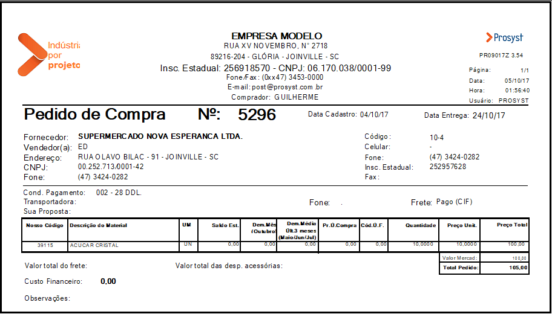

## Projeto Prototipo

Fiz esse mini projeto nos últimos quatro dias (no caso, foi antes do dia 15 que comecei ele, mas só fui dar uma polida nesse fim de semana) para demonstrar as capacidades que posso oferecer. Este projeto não foca tanto no front-end; como diferencial, busquei mostrar um pouco dos meus conhecimentos em machine learning e deep learning, incluindo a arquitetura de projetos baseados em IA, treinamento de IA, fine-tuning e afins.

Embora esse projeto não esteja perfeito, ele ilustra minhas habilidades em tópicos importantes.

A ideia geral é simples: uma arquitetura cliente-servidor. A stack do cliente foi desenvolvida em Next.js 15 e Tailwind, enquanto o servidor é em Python, utilizando Flask. Utilizei bibliotecas como Transformers do Hugging Face para alguns modelos e para o fine-tuning do UDOP. Também tentei usar o llm-cpp-python para verificar se a inferência na CPU do MiniCPM seria mais rápida, mas essa parte ainda não está completa. Após a extração, o servidor retorna um JSON contendo as informações do documento. Não implementei nenhum banco de dados, pois achei que isso tornaria o projeto muito grande, já que se trata apenas de um protótipo.

Na parte da extração, testei quatro tipos de modelos:

**DONUT**: Primeiro modelo da stack. Esse modelo foi feito pra esse tipo de task, então os resultado (basedo no fine tuning) são bem boms. É leve e rápido. O problema é que, devido à impossibilidade de usar minha GPU, não consegui treiná-lo em um dataset específico. A versão que estou usando é "naver-clova-ix/donut-base-finetuned-cord-v2". Embora já esteja fine-tuned, o dataset CORD é específico para listas de produtos em notas fiscais, resultando em desempenhos ruins em documentos gerais. 

**UDOP**: Este modelo é baseado no DONUT e funciona de maneira semelhante. Utilizei-o para demonstrar minhas capacidades em fine-tuning. Treinei melhor no Kaggle, mas, como usei o CORD, não cheguei a implementar o modelo fine-tuned, já que isso seria redundante em relação ao DONUT.

**MiniCPM-V 2.6**: Este LLM forneceu os melhores resultados. Ele tem um benchmark muito alto na parte do OCR e não me deu dor de cabeças na maiora dos layouts de documentos que testei. Contudo, a inferência por CPU é bastante lenta. No Kaggle, usando uma GPU P100, consegui resultados em menos de um minuto. Testei a versão padrão, a versão 4 bits (quantização) e a GGUF. No Kaggle, com uma GPU T4 ou P100, a versão 4 bits se mostrou excelente, sem perda de qualidade em relação ao modelo original. A GGUF foi testada para verificar melhorias na inferência por CPU, mas na minha máquina ainda é muito lenta, levando de 10 a 15 minutos. Não sei se isso se deve a limitações de hardware ou a algum erro meu. Entretanto, como a inferência por GPU (NVIDIA) funciona perfeitamente, decidi não focar tanto nisso por enquanto.

exemplo: 

    {
    "id": 5296,
    "date": "04/10/17",
    "company": "SUPERMERCADO NOVA ESPERANCA LTDA.",
    "phone": "(47) 3424-0282",
    "address": "OLAVO BLABIL - 91 - JOINVILLE - SC",
    "items": [
        {
            "id": "39115",
            "name": "ACUCAR CRISTAL UN",
            "price": 10.00
        }
    ],
    "total": 100.00,
    "subtotal": 100.00,
    "tax": 0.00,
    "payment": {
        "name": "Guilherme",
        "company": "None",
        "email": "post@prosyst.com.br",
        "address": "PODOE 002 - 28 DDL.",
        "phone": "(47) 3424-0282",
        "account_number": "252957628",
        "due_date": "24/10/17"
    }
}

Esse resultado depois de uma trabalhada no prompt que mandamos pro modelo, já deu resultos boms. Com um fine tuining especifico pra documentos em português e algums layouts, o resulto seria muito superior

nota: minha máquina tem uma rx 7600 da AMD. O Rocm só tem o HIP SDK disponivel pra windows, no entanto o PYTORCH não funciona direito com a minha placa no windows. Sendo assim, não tem como eu fazer inferencia por GPU no meu computador. Por WSL 2, meu driver não tem suporte pra isso (a AMD não dá suporte pro ROCM no wsl pra minha placa)

